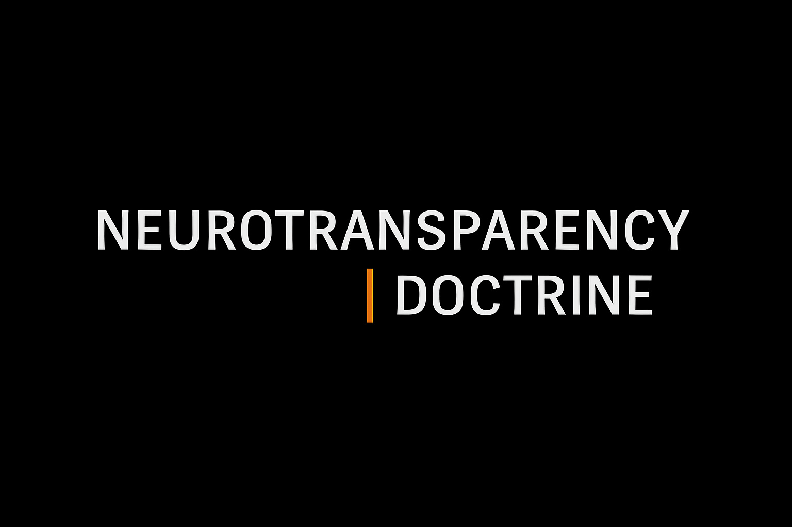

<p align="center">
  
</p>

# Neurotransparency Doctrine  
*Foundational Epistemic Framework for Cognitive Integrity in AI–Human Scientific Workflows*  

**Waveframe Labs · Aurora Research Initiative (ARI)**  
[](https://waveframelabs.org)
[](https://github.com/Waveframe-Labs/Aurora-Research-Initiative)
[](https://doi.org/INSERT_CONCEPT_DOI_HERE)
[](https://orcid.org/0009-0006-6043-9295)  
[](https://creativecommons.org/licenses/by/4.0/)

---

## Overview  
The Neurotransparency Doctrine establishes the epistemic boundary conditions required for cognition—human or synthetic—to legitimately influence scientific claims.  
It defines the eight axioms of neurotransparency, forming the philosophical foundation for:

- Neurotransparency Specification (NTS)  
- Aurora Workflow Orchestration (AWO)  
- Aurora Research Initiative (ARI)  
- CRI-CORE  

Neurotransparency replaces *trust* with *trace*, ensuring scientific reasoning remains reconstructible, attributable, and integrity-protected in distributed AI–human workflows.

---

## Scope & Context  
This repository hosts the **canonical source** of the Neurotransparency Doctrine.  
It provides the philosophical and epistemic foundation for the entire Aurora research ecosystem.

What this repository contains:

- The doctrine (Markdown format)  
- Figures, banners, and citation metadata  
- License and citation files  
- Version history and governance logs (as added)

What this repository does *not* contain:

- PDF artifacts  
- Specification-level requirements (these belong in the NTS repository)  
- Tooling, workflows, or executables  
- AWO or CRI-CORE implementation files  

This separation ensures clarity, provenance, and long-term governance integrity.

---

## Repository Structure
```
/doctrine    - Canonical doctrine source (Markdown)
/figures     - Visual assets and banners   
- Citation metadata (CITATION.cff)
- License (CC BY 4.0)
- README
```
---

## PDF Release Artifact

The canonical PDF for Doctrine v1.0.0 is **not committed to the repository**.
It will be generated deterministically using Waveframe Labs’ PDF Forge and published as a **release asset** attached to the `v1.0.0` GitHub release.

---

## Citation  
```
Wright, Shawn C. (2025). Neurotransparency Doctrine:
Epistemic Foundations for AI–Human Scientific Cognition.
Waveframe Labs / Aurora Research Initiative (ARI).
Version 1.0.0
DOI: TBD
```

citation metadata is provided in the root `CITATION.cff` file.

---

## License  
This work is released under the **Creative Commons  
Attribution 4.0 International (CC BY 4.0)** license.

---

## Full Doctrine  
➡️ [Neurotransparency Doctrine](doctrine/Neurotransparency_Doctrine.md)

---

<div align="center">
  <sub>© 2025 Waveframe Labs — Independent Open-Science Research Entity • Governed under the Aurora Research Initiative (ARI)</sub>
</div>
